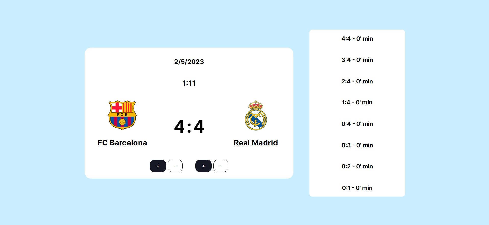

In March 2023 I attended a 2-month long React education at [Digitalna Dalmacija](https://digitalnadalmacija.hr/). The education lasted for 8 weeks, and every week I was required to build a new project. This is the projects I build in the 2nd week.

## Table of contents

- [Challenge](#challenge)
- [Screenshot](#screenshot)
- [Links](#links)
- [Built with](#built-with)
- [What I learned](#what-i-learned)

### Challenge

The task was to build a React app that simulates a football match. Once the user starts the match, he can score goals. Once the timer gets to 90 minutes, the match is over and the user can see the result of the match. The user is also able to restart the match with all the values reset. During the match, the user can see the time when each goal was scored.

### Screenshot

### Links

- Live Site URL: https://football-match-simulator-jure.netlify.app/

### Built with

- [React](https://reactjs.org/)

### What I learned

The second week was not intended to be much harder than the first week, but since I wanted to add some extra features to my app, it ended up taking me a little bit more time.

I mostly know everything up to this point, but I did learn a little more in-depth about how React state works under the hood.
